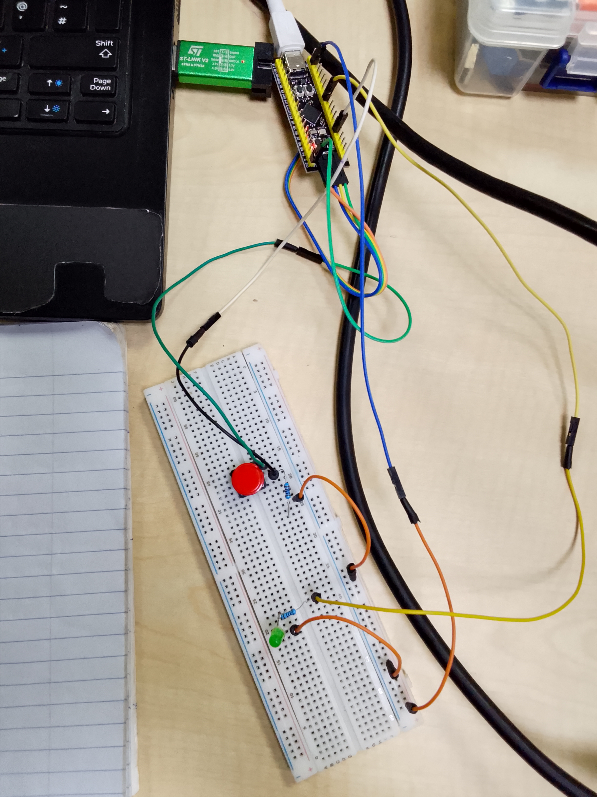

# STM32F401CCU6 Toggle LED Every Button Press

## Final Outcome
Each button press toggles the LED state.

## Learning
- Edge Detection
- Software Debouncing
- State Variables

## Project Code
[Click here for the project code](code)

## Project images 

## Components
- STM32F401CCU6 Black Pill
- LED
- Push Button
- 220Ω Resistor
- 10kΩ Resistor

## Project Demonstration video

[Click here to check out the Demo video](https://youtube.com/shorts/dkmK5bPAbeY?feature=share)

## Pin Connection
PA0 → Button  
PA6 → LED

